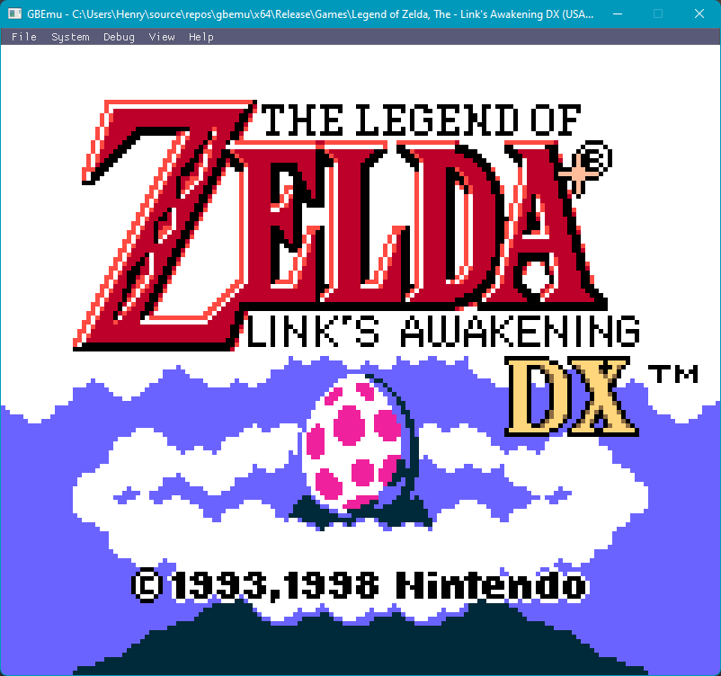

# gbemu
Reasonably accurate Game Boy (DMG) and Game Boy Color (CGB) emulator, runs most commercial games with no major issues. Developed for NEA project.

### Features
- Accurate DMG and CGB emulation (scanline renderer, pixel FIFO is WIP)
- Supports CGB color correction, alongside frame blending
- Currently supports MBC1,MBC3, and MBC5 mappers, with save-states for battery backed cartridges
- Passes blargg cpu_instrs and instr_timing
- Passes dmg-acid2 (both in DMG and CGB mode), and cgb-acid2

### Example screenshots

